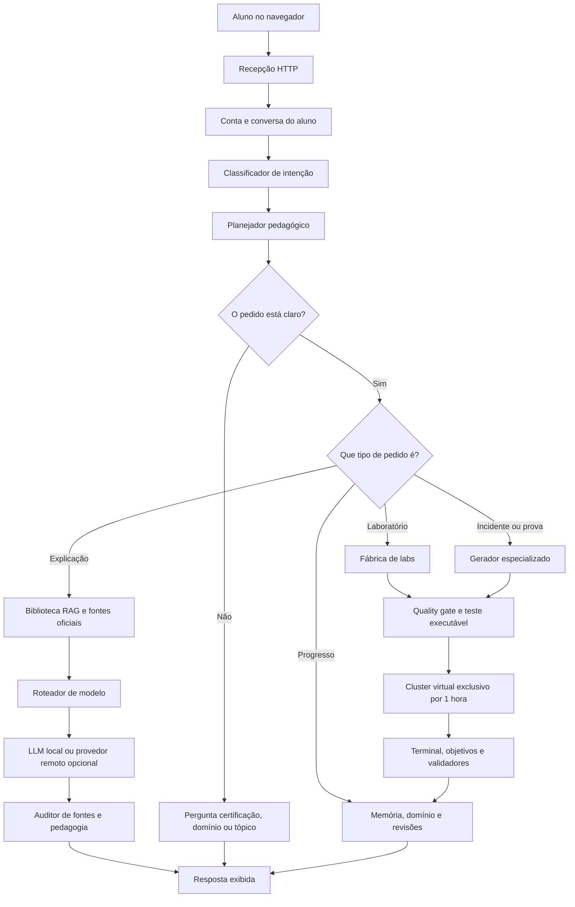
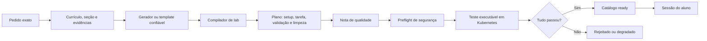
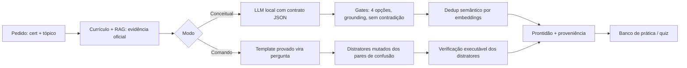

# Arquitetura do Tutor Técnico

> Este documento explica o tutor inteiro, primeiro como se ele fosse uma escola
> pequena e depois com os nomes reais usados no código. A ideia é permitir que
> uma pessoa sem experiência em programação entenda o caminho completo: da
> pergunta digitada até o laboratório funcionando em um cluster descartável.

## A explicação em uma frase

O tutor é uma escola automática: ele escuta o aluno, descobre o que ele quer
aprender, consulta livros confiáveis, escolhe a melhor forma de ensinar, prepara
um exercício, testa o exercício antes de entregá-lo e anota o resultado para
escolher a próxima atividade.

## A escola vista de cima



Não se assuste com o desenho. Cada caixa faz uma tarefa pequena. O valor está em
não deixar uma única IA tomar todas as decisões sozinha.

## Os personagens da escola

### 1. A recepcionista: interface e handlers

A recepcionista recebe o que o aluno digitou, verifica se a mensagem faz
sentido, identifica a conta e entrega o pedido ao setor correto.

No projeto, ela é formada principalmente por:

- `web/templates/tutor.html`: tela de conversa, seletor de certificação,
  documentos, tópicos, progresso e ações de laboratório;
- `internal/handlers/tutor.go`: endpoints HTTP do tutor;
- `main.go`: registro das rotas;
- `internal/handlers/auth.go` e `profile.go`: login e identidade do aluno.

Quando `APP_PASSWORD` está configurado, ele funciona como código de convite.
Cada pessoa cria a própria conta e recebe um identificador próprio. Sem essa
configuração, o modo local usa o perfil `default`.

Essa identidade acompanha conversas, progresso, checkpoints, sessões e o
cluster temporário. Assim, a anotação do aluno A não aparece para o aluno B.

### 2. O guarda de trânsito: classificador de intenção

Antes de chamar uma LLM, o tutor tenta entender o pedido com regras
determinísticas. “Determinístico” quer dizer: recebendo a mesma informação, a
regra toma a mesma decisão.

Exemplos de intenções reconhecidas:

- criar ou praticar um lab;
- fazer prova ou simulado;
- revisar um erro;
- ver progresso;
- diagnosticar uma falha;
- comparar tecnologias;
- pedir uma explicação livre.

Os arquivos principais são `internal/tutor/intent_classifier.go` e
`internal/tutor/chat.go`.

Isso também ajuda com pequenos erros de digitação. O tutor procura palavras,
certificações e tópicos normalizados antes de desistir. Se ainda houver mais de
uma interpretação razoável, ele deve perguntar o que o aluno quis dizer em vez
de inventar uma certeza.

### 3. O coordenador: orquestrador do turno

O coordenador monta um plano curto para cada mensagem:

1. observar o objetivo, nível e contexto;
2. recuperar fontes e memória pedagógica;
3. usar somente ferramentas autorizadas;
4. ensinar com a estratégia adequada;
5. verificar fontes e próximo passo.

O plano fica em `internal/tutor/orchestrator.go`. Ele possui limite de três
chamadas de ferramenta e uma revisão por turno. Isso evita que o tutor fique
preso pesquisando sem parar.

O coordenador escolhe estratégias diferentes. Um incidente usa a sequência
“hipótese, evidência e teste”. Um iniciante recebe explicação em degraus. Uma
revisão usa recuperação ativa. Um pedido avançado usa comparação, trade-offs e
contraexemplos.

### 4. A professora: planejador pedagógico

A professora não pergunta apenas “qual assunto?”. Ela olha também:

- o que o aluno já acertou;
- o que ele errou;
- quantas dicas abriu;
- se viu a solução;
- quais revisões estão atrasadas;
- quais pré-requisitos ainda faltam;
- se o assunto já foi realmente dominado.

Essa lógica está em `internal/tutor/pedagogical_planner.go`, `tracker.go`,
`mastery.go`, `learning_paths.go` e `advisor.go`.

A LLM pode deixar a explicação mais natural, mas não pode alterar gates de
domínio, histórico ou pré-requisitos. Essas decisões são do backend.

### 5. A bibliotecária: fontes oficiais e RAG

RAG significa, de forma simples, “procurar trechos úteis antes de responder”.
A bibliotecária:

1. lê materiais permitidos;
2. divide o conteúdo em pedaços menores;
3. guarda cada pedaço com certificação, domínio, tópico e URL;
4. procura os pedaços mais próximos do pedido;
5. entrega esses pedaços ao professor e à LLM.

O motor em `internal/tutor/rag.go` combina três sinais:

- palavras importantes, no estilo BM25;
- proximidade semântica por embeddings;
- metadados de certificação e tópico.

No deploy atual, `embeddinggemma` cria os embeddings. Se o serviço de embedding
não estiver disponível, existe busca lexical local como degradação segura.

As fontes passam por allowlist e o texto recuperado é limpo contra instruções
maliciosas. Uma página que diga “ignore todas as regras” não vira a nova regra
do tutor.

### 6. O seletor de livro e capítulo: currículo e documentação

Há dois caminhos relacionados, mas diferentes.

No caminho de certificação, `VerifyCurriculum` recebe uma certificação, procura
o currículo conhecido ou lê uma URL oficial fornecida. A resposta forma uma
árvore:

```text
Certificação
└── Domínio
    └── Competência
```

Por exemplo:

```text
CKA
└── Cluster Architecture, Installation & Configuration
    ├── Manage role based access control (RBAC)
    ├── Create and manage Kubernetes clusters using kubeadm
    └── Use Helm and Kustomize to install cluster components
```

Se o aluno pediu apenas “crie um lab para CKA”, o tutor não deve adivinhar um
tópico. Primeiro oferece os domínios. Depois oferece as competências do domínio
escolhido. Só então gera o exercício.

No caminho de documento, `AnalyzeDocumentTopics` lê os títulos reais da página
e devolve tópicos selecionáveis. Se o aluno colar a documentação de
`assign-pod-node` e escolher “Inter-pod affinity and anti-affinity”, a geração
recebe exatamente essa seção e seu link ancorado, não um assunto genérico de
scheduling.

Essas rotas estão em:

- `internal/tutor/curriculum_catalog.go`;
- `internal/tutor/curriculum_learned.go`;
- `internal/tutor/document_topics.go`;
- `internal/handlers/tutor.go`.

Uma competência sem lab pronto pode aparecer como pesquisável. Nesse caso o
tutor explica que precisa pesquisar a documentação oficial e só entrega o lab
se conseguir compilá-lo e validá-lo.

### 7. O roteador de modelos: rápido, profundo ou local

O tutor calcula uma pontuação simples de complexidade. Arquitetura, segurança,
incidente, migração, produção, comparação, código grande e modo profundo pesam
mais. Pedidos curtos e objetivos pesam menos.

O comportamento fica em `internal/tutor/model_routing.go`:

- sem provedor remoto, usa o modelo local;
- com provedor remoto, pedidos simples podem usar o modelo rápido;
- pedidos complexos ou modo profundo podem usar o modelo frontier;
- um modelo candidato pode receber uma porcentagem determinística das
  perguntas para teste canário;
- o resultado de grounding de cada modelo é medido e pode recomendar rollback.

O deploy hospedado atual configura:

```text
conversa e geração: qwen3:8b
roteamento rápido:  qwen3:4b
embeddings:          embeddinggemma
```

O código também aceita qualquer API compatível com o formato de chat da
OpenAI, mas ela é opcional e só fica ativa com chave e modelo configurados.

#### Regra especial do GPT-5.6 Sol

O limite de perguntas existe somente para o GPT-5.6 Sol. Por padrão são dez
perguntas por usuário. Modelos locais e outros modelos remotos não usam esse
limite.

Antes de reservar uma pergunta, `internal/tutor/premium_usage.go` verifica qual
modelo foi realmente escolhido. Se for Sol, incrementa o contador persistente.
Se a chamada falhar, devolve a reserva. Quando o limite acaba, escolhe o modelo
rápido de fallback. Configurar um nome de modelo não significa que ele já está
ativo: o provedor remoto também precisa estar configurado e disponível.

### 8. O redator: LLM local ou remota

A LLM redige explicações e conteúdo quando uma regra especializada não resolveu
o pedido. Ela não recebe liberdade total.

As saídas estruturadas usam contratos JSON em `internal/tutor/llm_contract.go`.
Um contrato informa campos obrigatórios, tipos e valores mínimos. Se a resposta
vier inválida, o backend pede uma correção. Se continuar inválida, rejeita a
saída.

Há também:

- timeout por chamada;
- limite de tokens;
- fila de concorrência;
- cancelamento quando o navegador abandona a requisição;
- streaming de texto;
- cache curto de respostas grounded;
- fallback determinístico quando o modelo falha.

No runtime atual, `OLLAMA_MAX_CONCURRENCY=1` protege a VM de muitas gerações
pesadas ao mesmo tempo.

### 9. O revisor: grounding e citações

Grounding é a regra “não fale como fato técnico aquilo que não foi sustentado”.

Antes da resposta, `CheckAnswerability` mede se existem currículo, evidências,
RAG e fontes suficientes. Se não houver, o tutor pode recusar ou pedir mais
contexto.

Depois da resposta, `AuditGroundedReply` separa afirmações técnicas e verifica:

- cobertura por citações ou termos ancorados nas evidências;
- referências inexistentes;
- URLs inventadas;
- cobertura mínima de 80%.

No streaming, as frases são auditadas antes de serem publicadas. Uma frase
técnica sem suporte pode ser omitida. No modo normal, uma resposta técnica que
falhar no contrato inteiro é substituída por uma explicação honesta de que não
houve evidência suficiente.

`AuditTeachingResponse` avalia também se a resposta seguiu a estratégia
pedagógica, em vez de apenas despejar uma solução.

## A fábrica de laboratórios

Gerar texto é fácil. Gerar um exercício que realmente funciona é a parte
difícil. Por isso o tutor usa uma linha de montagem.



### Etapa 1: entender o assunto exato

`GenerateSmartLabs` escolhe certificação, competência, nível e quantidade a
partir do pedido. `GenerateDocumentLabs` usa uma página e seção específicas.
Templates conhecidos são preferidos porque são previsíveis; assuntos novos
podem ser gerados a partir das evidências recuperadas.

O endpoint direto aceita de um a oito labs por sessão. A regra de dez perguntas
do GPT-5.6 Sol é outra coisa: limita uso do modelo premium, não a quantidade
geral de exercícios do produto.

### Etapa 2: compilar um contrato de laboratório

`internal/tutor/lab_compiler.go` transforma a questão em um pacote coerente:

- objetivo;
- cenário;
- namespace;
- preparação;
- tarefa visível ao aluno;
- solução oculta;
- validadores automáticos;
- critérios de sucesso;
- limpeza;
- dependências;
- fontes e evidências;
- estimativa de tempo;
- metadados de interface.

Comandos e validadores são alinhados ao mesmo namespace. Validadores são
endurecidos para devolver resultados determinísticos em vez de depender de uma
frase bonita.

### Etapa 3: medir a qualidade

`internal/tutor/lab_agent.go` calcula uma nota. Um lab gerado precisa atingir no
mínimo 70 pontos. A avaliação considera, entre outros itens:

- objetivo claro;
- cenário prático;
- solução e validação presentes;
- limpeza declarada;
- evidência oficial;
- chunks RAG relacionados;
- critérios de sucesso;
- ausência de comandos bloqueados;
- ausência de spoilers no enunciado.

### Etapa 4: preflight

`internal/tutor/lab_plan.go` confere o plano inteiro antes da entrega. Ele
detecta, por exemplo, setup vazio, solução vazia, validação ausente, comandos
perigosos e exercício que já entrega a resposta pronta.

Há ainda um gate conservador de permissões em
`internal/tutor/student_permissions.go`. Ele foi criado quando alunos recebiam
apenas permissões por namespace. O ambiente hospedado agora usa vCluster com
administração completa dentro do cluster virtual; portanto esse gate precisa
continuar sendo revisado para não bloquear desnecessariamente um lab
cluster-scoped que já é seguro no novo isolamento.

### Etapa 5: teste executável

Em produção, um lab Kubernetes gerado não deve chegar ao aluno apenas porque o
JSON parece correto. `internal/tutor/k8s_verify.go` executa o ciclo:

1. cria um namespace de teste;
2. executa o setup;
3. confirma que o validador ainda não passa antes da solução;
4. executa o gabarito;
5. espera a convergência dos recursos;
6. exige que todos os validadores passem;
7. executa o teardown;
8. confirma a remoção do namespace.

O resultado fica no catálogo de prontidão com digest SHA-256 do conteúdo. Se o
conteúdo mudar, a verificação antiga deixa de valer. Estados possíveis incluem
`compiled`, `ready`, `degraded` e `rejected`.

Um lab Kubernetes gerado que deveria ser verificado, mas não está `ready`, é
bloqueado antes de abrir para o aluno.

## A fábrica de questões de múltipla escolha

Gerar um lab que roda é difícil; gerar uma pergunta de prova que seja **de fato
correta** é difícil de outro jeito. O maior risco é servir como fato técnico uma
alternativa que a IA inventou. Por isso as questões geradas passam por uma linha
de montagem própria, com a mesma filosofia dos labs: nenhuma LLM sozinha decide
o que chega ao aluno.



Há dois modos, expostos em `POST /api/tutor/author-mcq`:

**Conceitual** (`internal/tutor/mcq_author.go`, `AuthorMCQBatch`). A partir da
evidência do currículo e dos chunks do RAG — nunca de um texto qualquer — a IA
local escreve questões sob o contrato JSON `quiz`. Cada questão passa por gates
determinísticos: exatamente quatro alternativas, resposta ancorada na fonte
(`groundedInSource`), sem alternativas repetidas, e embaralhamento anti-viés de
posição. Os distratores são guiados pelos **pares de confusão reais**
(`confusionSets`) — o que o aluno de fato troca na prova, não uma opção fácil de
eliminar.

**Comando** (`internal/tutor/mcq_verify.go`, `AuthorCommandMCQBatch`). A questão
nasce de um template de lab cuja resposta e validador já são provados: o
enunciado vira “qual comando cumpre o objetivo?”, a alternativa correta é o
comando real e os distratores são mutações plausíveis (flag-irmã do conjunto de
confusão, verbo trocado, valor trocado). Quando `K8S_LAB_VERIFY_GENERATED=1`,
cada distrator é **executado num namespace efêmero** e precisa NÃO satisfazer o
validador do efeito; se um distrator também “passar”, a questão é ambígua e é
rejeitada. É o análogo, para questões, da prova executável dos labs.

Entre a geração e a publicação há o **juiz de correção**
(`internal/tutor/mcq_judge.go`). O grounding prova que a resposta *aparece* na
fonte, não que ela *é* a resposta — um modelo fraco chega a marcar uma
alternativa e escrever uma explicação que a contradiz, e isso passa no grounding.
O juiz ataca isso respeitando a regra “não julgar com o mesmo modelo fraco é
eco”: com gateway remoto, um modelo forte decide se a alternativa marcada é a
única correta e se a explicação a sustenta; sem gateway, o modelo local
**resolve a própria questão algumas vezes** (self-consistency) e, se discordar da
marcada ou não formar maioria, a questão é rejeitada. Isso separa autoria de
serving na prática: **autora-se com o modelo mais forte disponível**
(`authoringModel`, custo amortizado por todos os alunos) e serve-se local.
Questões que o juiz confirma recebem o selo `judged`, entre `grounded` (só
ancoragem) e `verified` (execução).

Dois gates transversais fecham a linha:

- **Dedup semântico** (`internal/tutor/mcq_dedup.go`). O `qKey` do repositório só
  barra texto idêntico; aqui comparamos o enunciado por embeddings (o mesmo sinal
  denso do RAG). Paráfrases do mesmo enunciado ficam ~0.90 de similaridade e
  questões distintas ≤0.33 — o corte em 0.88 separa com folga. A identidade é o
  **enunciado**, não o par pergunta→resposta: modelos fracos reemitem a mesma
  pergunta com respostas diferentes (às vezes contraditórias), e essas colapsam
  numa só.
- **Prontidão e proveniência** (`models.QuestionReadiness`). Espelha
  `LabReadiness`: estado `grounded` (ancorada em evidência), `verified`
  (distratores provados errados por execução) ou `rejected`, com digest do
  conteúdo e catálogo em `data/quiz/catalog.json`. O aluno vê a diferença entre
  “existe” e “foi provada”.

A qualidade do modo conceitual depende diretamente da riqueza do RAG: com o
índice hidratado (documentos oficiais + embeddings) o grounding aprova questões
legítimas; com evidência fraca ele fecha a porta em vez de arriscar alucinação.

## O cluster de cada aluno

No ambiente hospedado, “um cluster por aluno” significa um vCluster por sessão
ativa. Ele possui API server, RBAC, namespaces, CRDs e recursos globais próprios,
mas usa os nós do AKS compartilhado. Isso é muito mais rápido e barato que criar
um AKS inteiro para cada pessoa.

O fluxo é:

1. o backend cria um lease absoluto de uma hora;
2. confirma que o AKS está pronto;
3. confirma capacidade e autoscaler;
4. cria um namespace host exclusivo;
5. instala o vCluster com Helm;
6. espera o kubeconfig interno;
7. cria o shell usando apenas esse kubeconfig;
8. só então libera terminal e setup.

O pod do terminal não recebe token de ServiceAccount do AKS host. Para o aluno,
`kubectl get pods -A`, ClusterRoles e CRDs operam dentro de seu Kubernetes
virtual. Ele não enxerga os clusters dos colegas.

Cada namespace host possui quota, limites padrão, Pod Security Admission,
NetworkPolicy e bloqueio ao Azure Instance Metadata Service. O control plane do
vCluster usa um PVC de 1 GiB durante a sessão.

### O relógio de uma hora

O prazo nasce no servidor, não no JavaScript. Atualizar a página, avançar uma
questão ou reabrir o navegador não renova o tempo.

Quando o aluno conclui, encerra manualmente ou o tempo termina:

1. o terminal é fechado;
2. o backend apaga o namespace host;
3. vCluster, shell, workloads e PVC são removidos juntos;
4. o lease só é esquecido depois que a exclusão foi confirmada;
5. se o AKS estiver indisponível, o coletor tenta novamente a cada 30 segundos.

Os arquivos centrais são:

- `internal/handlers/lab_environment.go`;
- `internal/repository/lab_environment.go`;
- `internal/handlers/terminal.go`;
- `internal/handlers/lab.go`;
- `docs/isolamento-por-usuario.md`.

### Limite real do isolamento

Os control planes são separados, mas os containers ainda rodam nos mesmos nós
AKS. Isso é adequado para estudo. Não é a mesma proteção de uma VM, um node pool
ou um AKS físico exclusivo.

Labs que precisam mexer no kubelet do nó real, no etcd real ou executar
`kubeadm` em máquinas completas exigem uma futura modalidade de cluster físico
descartável.

## Como o aluno aprende com o resultado

Cada evento importante volta para o tracker:

- tentativa e acerto por objetivo;
- dica aberta;
- solução revelada;
- lab concluído;
- lab pulado;
- falha de ambiente;
- erro visto no terminal;
- tempo de execução.

O domínio usa uma média móvel para que resultados recentes tenham peso sem
apagar o histórico inteiro. O mastery gate normalmente exige pontuação mínima,
quantidade de tentativas e nenhuma revisão vencida.

Quando um conteúdo precisa ser revisto, entra na fila de repetição espaçada. Um
acerto aumenta o intervalo; uma falha reduz o intervalo. Assim o tutor não
confunde “acertou hoje” com “aprendeu de verdade”.

Checkpoints curtos são ligados à conversa. Depois de uma explicação, o tutor
pode pedir que o aluno explique com suas palavras. Responder com um novo comando
explícito não é confundido com a resposta ao checkpoint.

## Onde os dados ficam

Em produção, o projeto usa PostgreSQL quando `DATABASE_URL` está configurada. A
tabela `app_documents` guarda documentos JSON por tipo e chave. Isso permite
persistir estruturas diferentes sem criar uma tabela nova para cada uma.

Exemplos persistidos:

- perfil, habilidades e histórico do aluno;
- conversas;
- checkpoints;
- uso do modelo premium;
- leases dos clusters temporários;
- currículos aprendidos e outros estados do tutor.

Quando o PostgreSQL não está configurado ou fica temporariamente indisponível,
vários componentes preservam um fallback em arquivos dentro de `data/`. Esse
modo é útil no desenvolvimento local, mas produção deve tratar PostgreSQL como
fonte durável.

Perguntas curadas vêm dos arquivos embutidos. Perguntas geradas são carregadas
do diretório configurado. O catálogo de prontidão dos labs fica separado para
não confundir “conteúdo existe” com “conteúdo foi testado”.

## APIs principais

| Rota | Para que serve |
|---|---|
| `GET /tutor` | Abre a interface do tutor. |
| `GET /api/tutor/status` | Retorna progresso, recomendações, domínio, RAG, LLM e sessão ativa. |
| `POST /api/tutor/chat` | Responde uma mensagem de uma vez. |
| `POST /api/tutor/chat/stream` | Responde em streaming. |
| `POST /api/tutor/curriculum/verify` | Verifica certificação e devolve domínios e competências. |
| `POST /api/tutor/document/topics` | Lê uma documentação permitida e devolve seções escolhíveis. |
| `POST /api/tutor/generate` | Gera labs de um tópico e cria a sessão. |
| `POST /api/tutor/ingest` | Transforma texto fornecido em labs e quiz. |
| `POST /api/tutor/author-mcq` | Gera questões de múltipla escolha sob demanda (modo conceitual ou comando). |
| `POST /api/tutor/event` | Registra ações do aluno. |
| `GET /api/tutor/eval` | Expõe avaliações automatizadas. |
| `GET /api/tutor/admin-quality` | Junta métricas de qualidade para operação. |
| `GET /api/tutor/deploy-gate` | Diz se os gates mínimos permitem publicar. |
| `GET /api/lab/environment` | Mostra cluster ativo e segundos restantes. |
| `DELETE /api/lab/environment` | Encerra e apaga o cluster do aluno. |
| `GET /ws/terminal` | Abre o terminal interativo por WebSocket. |
| `GET /healthz` | Confirma que o processo está vivo. |
| `GET /readyz` | Confirma que as dependências necessárias estão prontas. |

## Dois exemplos completos

### Exemplo A: “Crie um lab CKA sobre NodePort”

1. a recepção identifica conta, CKA e intenção de prática;
2. o classificador encontra `Services & Networking` e NodePort;
3. o cluster base precisa ficar pronto antes da geração;
4. currículo e RAG recuperam evidência oficial;
5. o gerador cria setup, tarefa, gabarito, validadores e teardown;
6. o compilador alinha namespace e comandos;
7. quality gate e preflight avaliam o pacote;
8. o verificador prova que o validador falha antes e passa depois da solução;
9. a sessão é criada;
10. o vCluster de uma hora é preparado;
11. o aluno executa o exercício no terminal;
12. o resultado atualiza domínio e revisão.

### Exemplo B: URL de scheduling + “Affinity and anti-affinity”

1. a interface envia a URL para `/api/tutor/document/topics`;
2. o backend aceita apenas uma origem confiável;
3. a página é lida e seus títulos reais são extraídos;
4. o aluno escolhe “Inter-pod affinity and anti-affinity”;
5. `/api/tutor/generate` recebe URL, seção, certificação, nível e quantidade;
6. a fábrica usa a seção escolhida como assunto exato e fonte;
7. só um lab aprovado no ciclo completo vira sessão estudável.

## O que acontece quando algo dá errado

| Falha | Comportamento esperado |
|---|---|
| AKS não sobe | Nenhum lab é criado; o aluno recebe erro explícito. |
| Documento não é permitido | A leitura é bloqueada e a origem é informada. |
| Documento tem pouco conteúdo | O backend pede outra fonte ou mais contexto. |
| Pedido está amplo | O tutor pergunta domínio e depois competência. |
| LLM não responde | Usa fallback determinístico ou informa a limitação. |
| JSON da LLM é inválido | Tenta corrigir; persistindo o erro, rejeita. |
| Fonte é insuficiente | Não publica afirmações técnicas sem suporte. |
| Lab tem nota baixa | Não é tratado como pronto. |
| Gabarito não passa | Lab fica rejeitado e não abre para o aluno. |
| Permissão seria insuficiente | O gate bloqueia antes de o aluno encontrar `Forbidden`. |
| Navegador fecha | O lease continua no servidor e expira normalmente. |
| Limpeza falha | O lease é mantido e o GC tenta apagar novamente. |
| GPT-5.6 Sol acaba | Apenas o Sol cai para o modelo de fallback. |

## Observabilidade e qualidade de publicação

O tutor mede latência média, p50, p95, p99, falhas e tempo até o primeiro token
por etapa. As amostras podem ser persistidas em JSONL.

O painel administrativo reúne:

- saúde do RAG;
- qualidade de prompts;
- regressões de grounding;
- prontidão dos modelos;
- catálogo de labs;
- métricas de latência;
- resultados de experiências entre modelos.

O deploy gate transforma esses sinais em uma resposta simples de aprovação ou
bloqueio. No CI, o projeto também executa formatação, `go vet`, build, testes,
race detector, auditoria frontend, validações E2E, Terraform, secret scan,
vulnerability scan e geração de SBOM antes de trocar o container de produção.

## Onde procurar no código

```text
main.go
├── registra as rotas e liga os componentes
internal/handlers/
├── tutor.go                 entrada HTTP do tutor
├── auth.go                  contas e sessões de login
├── lab.go                   execução e validação do lab
├── lab_environment.go       vCluster e lease de 1 hora
└── terminal.go              terminal WebSocket
internal/tutor/
├── chat.go                  roteamento funcional da conversa
├── intent_classifier.go     identifica o pedido
├── orchestrator.go          plano do turno
├── pedagogical_planner.go   estratégia baseada no aluno
├── curriculum_*.go          certificações, domínios e competências
├── document_topics.go       capítulos reais de documentação
├── rag.go                   biblioteca híbrida
├── grounding*.go            evidência e auditoria
├── model_routing.go         rápido, profundo, local e canário
├── llm*.go                  Ollama, remoto, contratos e runtime
├── smart_labs.go            geração livre orientada por certificação
├── lab_agent.go             especificação e nota de qualidade
├── lab_compiler.go          montagem determinística
├── lab_plan.go              preflight
├── k8s_verify.go            prova executável
├── lab_readiness.go         catálogo ready/rejected
├── tracker.go               histórico de aprendizado
├── mastery.go               gate de domínio
└── checkpoints.go           perguntas curtas de retenção
internal/repository/
├── question.go              catálogo de questões
├── lab_session.go           sequência de labs
└── lab_environment.go       lease persistente do cluster
internal/persistence/
└── documents.go             PostgreSQL com documentos JSON
web/templates/
└── tutor.html               interface e comportamento do navegador
deploy/azure/
├── sync-runtime.sh          configuração do runtime
└── verify-runtime.sh        prova da versão publicada
```

## Glossário para não precisar fingir que já sabia

- **API:** uma porta organizada para dois programas conversarem.
- **Endpoint:** um endereço específico dessa porta.
- **Backend:** parte que roda no servidor e toma decisões.
- **Frontend:** tela e comportamento no navegador.
- **LLM:** modelo que entende e escreve linguagem.
- **RAG:** busca trechos confiáveis antes de pedir a resposta à LLM.
- **Embedding:** uma lista de números que aproxima textos com significado
  parecido.
- **Grounding:** exigência de sustentar afirmações em evidências.
- **Handler:** função que recebe uma requisição HTTP.
- **Gate:** porteiro que só deixa algo avançar se as regras passarem.
- **Preflight:** checagem antes da decolagem.
- **Lease:** aluguel com hora certa para terminar.
- **vCluster:** Kubernetes virtual com control plane próprio sobre nós
  compartilhados.
- **AKS:** Kubernetes gerenciado pela Azure.
- **RBAC:** regras dizendo quem pode fazer o quê.
- **CRD:** novo tipo de objeto ensinado ao Kubernetes.
- **WebSocket:** conexão contínua usada pelo terminal.
- **SSE/streaming:** resposta enviada aos poucos, sem esperar o texto inteiro.
- **Fallback:** plano B quando o plano principal falha.
- **Canário:** teste controlado de uma versão nova com poucos pedidos.
- **SBOM:** lista dos ingredientes de software da imagem publicada.

## Resumo final

O cérebro real do tutor não é uma única LLM. É a combinação de regras
determinísticas, memória de aprendizagem, currículo, documentação oficial, RAG,
roteamento de modelos, contratos, auditoria, fábrica de labs, verificação em
Kubernetes e isolamento temporário por aluno.

A LLM é uma professora-redatora dentro da escola. Ela é importante, mas não tem
a chave de todas as portas. Os gates do backend continuam responsáveis por
decidir o que é seguro, comprovado e pronto para chegar ao aluno.
